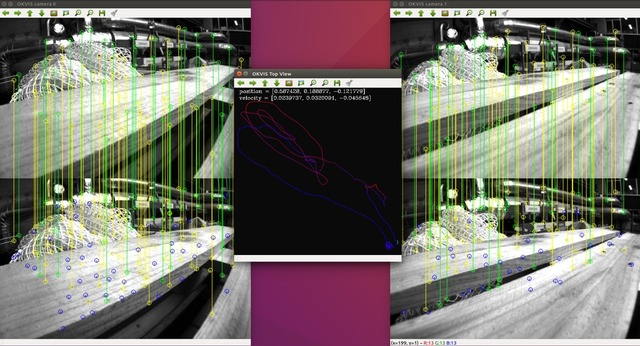

# okvis_cg

okvis ros wrapper and the core code is the modified version of **okvis-1.1.3**

> **OKVIS(Open Keyframe-based Visual-Inertial SLAM) tracks the motion of an assembly of an Inertial Measurement Unit (IMU) plus N cameras (tested: mono, stereo and four-camera setup) and reconstructs the scene sparsely.** This is the Author’s implementation of the [1] and [3] with more results in [2]. There is currently no loop-closure detection / optimisation included, but we are working on it.

**Code**
* [ethz-asl/okvis (Github)](https://github.com/ethz-asl/okvis)
* [ethz-asl/okvis_ros (Github)](https://github.com/ethz-asl/okvis_ros)

**Papers**
* [1] Stefan Leutenegger, Simon Lynen, Michael Bosse, Roland Siegwart and Paul Timothy Furgale. **Keyframe-based visual–inertial odometry using nonlinear optimization.** The International Journal of Robotics Research, 2015.
* [2] Stefan Leutenegger. **Unmanned Solar Airplanes: Design and Algorithms for Efficient and Robust Autonomous Operation.** Doctoral dissertation, 2014.
* [3] Stefan Leutenegger, Paul Timothy Furgale, Vincent Rabaud, Margarita Chli, Kurt Konolige, Roland Siegwart. **Keyframe-Based Visual-Inertial SLAM using Nonlinear Optimization.** In Proceedings of Robotics: Science and Systems, 2013.

-----

## Build

* okvis
  ```bash
  cd okvis
  mkdir build & cd build
  cmake .. & make -j4
  ```
* okvis_ros
  ```bash
  catkin_make
  ```

## Run

* okvis

MH_01_easy Dataset:

```bash
./okvis_app_synchronous \
    path/to/okvis/config/config_fpga_p2_euroc.yaml \
    path/to/MH_01_easy/mav0/
```
or
```bash
cd okvis & bash run_with_mav0.sh
```

* okvis_ros

MH_01_easy Dataset:

```bash
rosrun okvis_ros okvis_node_synchronous \
    path/to/okvis_ros/okvis/config/config_fpga_p2_euroc.yaml \
    path/to/MH_01_easy.bag
```
or  
```bash
roslaunch okvis_ros okvis_node_synchronous.launch [mono:=true]
```

<div align=center>
  
</div>

## Supported Camera and Distortion models

* pinhole camera model (pinhole) [fu fv pu pv]
  - equidistant [k1 k2 k3 k4]
  - radialtangential (plumb_bob) [k1 k2 r1 r2]
  - radialtangential8 (plumb_bob8)
  - none

## Outputs and frames

In terms of coordinate frames and notation,

* W denotes the OKVIS World frame (z up),
* C_i denotes the i-th camera frame
* S denotes the IMU sensor frame
* B denotes a (user-specified) body frame.

The output of the okvis library is the pose T_WS as a position r_WS and quaternion q_WS, followed by the velocity in World frame v_W and gyro biases (b_g) as well as accelerometer biases (b_a).

## HEALTH WARNING
If you would like to run the software/library on your own **hardware setup**, be aware that good results (or results at all) may only be obtained with appropriate calibration of the

* camera intrinsics,
* camera extrinsics (poses relative to the IMU),
* knowledge about the IMU noise parameters,
* and **ACCURATE TIME SYNCHRONISATION OF ALL SENSORS**.
